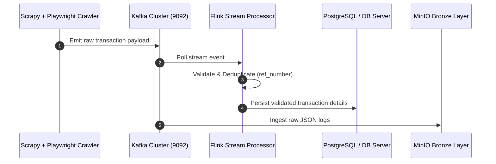
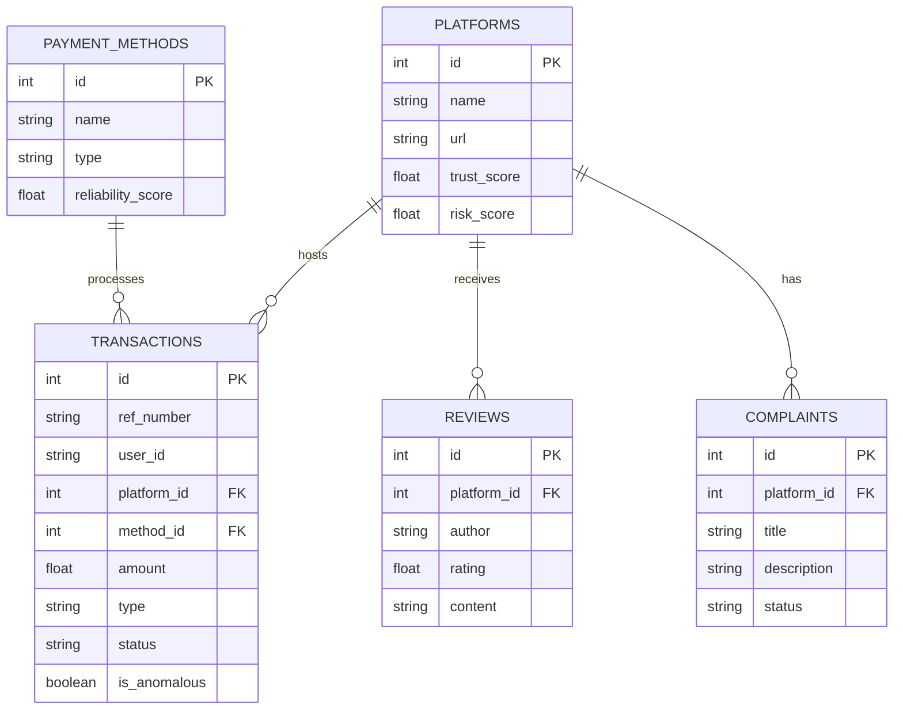

# Multi-Agent AI Data Lakehouse Platform
## Betting Site Data Intelligence & Analytics Console

> [!IMPORTANT]
> **CDAC Final Capstone Project - Clean Architecture Refactoring**  
> Reorganized the platform into Clean Architecture separation of concerns: Frontend, Backend API, Data Collection (Scrapy + Playwright), Streaming (Kafka), Storage (Iceberg + Nessie + PySpark), ML Models, RAG Search, and AI Agents.

---

## ⚡ Live Console Registry

Access the running modules on your web environment or spin them up locally:

| Component / Service | Environment | Access Link | Status Badge |
| :--- | :---: | :--- | :--- |
| **GitHub Pages Web Console** | **Live Web** | [https://957908.github.io/Multi-Agent-AI-Data-Lakehouse-Platform-Betting-Site-Data-Intelligence/](https://957908.github.io/Multi-Agent-AI-Data-Lakehouse-Platform-Betting-Site-Data-Intelligence/) |  |
| **Vite React UI Dashboard** | **Local Dev** | [http://localhost:3000](http://localhost:3000) |  |
| **FastAPI REST Backend** | **Local API** | [http://localhost:8085/docs](http://localhost:8085/docs) |  |
| **Grafana Metrics Analytics** | **Local Dev** | [http://localhost:3001](http://localhost:3001) |  |
| **MinIO Storage Dashboard** | **Local Dev** | [http://localhost:9001](http://localhost:9001) |  |

---

## 1. System Folder Reorganization

The repository has been refactored into modular cleanliness:

* **`scrapers/`**: Consolidated payment cashier crawlers. Includes `selenium/` standalone cashier scripts (1xBet, 10Cric, 22Bet) and the `scrapy/` crawler engine (Cric10, Melbet, Stake, Mostbet, Parimatch, Bet22).
* **`data_pipelines/`**: Unified ingestion and medallion ETL layers. Contains `kafka/` brokers (consumers, producers with DLQ), `flink/` stream processors (tumbling windows), and `spark/` Iceberg ETL jobs.
* **`ai_services/`**: AI and machine learning layers. Contains `ml_models/` classification and anomaly pipelines, `RAG/` semantic FAISS vector retrieval indexing, and `agents/` CrewAI orchestration loops.
* **`frontend/`**: React + TypeScript + Vite dashboard using Tailwind CSS and Recharts. Runs on port `3000`.
* **`backend/`**: FastAPI REST API following Repository Pattern, mapping models/schemas and supporting JWT session authentication. Runs on port `8085`.
* **`monitoring/`**: Prometheus config scraping backend diagnostic metrics and routing to Grafana (port `3001`).

---

## 2. Platform Architecture Diagrams

### Ingestion & Stream Processing Sequence


### Relational Entity Relationship Diagram (ERD)


---

## 3. Installation & Getting Started

### Step 1: Install Python and Node Libraries
1. Install Python packages:
   ```powershell
   pip install pandas numpy scikit-learn joblib sentence-transformers faiss-cpu fastapi uvicorn playwright sqlalchemy passlib python-jose email-validator kafka-python
   playwright install
   ```
2. Install Frontend Node modules:
   ```powershell
   cd D:\kadam\project\frontend\
   npm install
   ```

### Step 2: Spin Up Infrastructure Containers
Use Docker Compose from the root directory to launch databases, event brokers, and dashboards:
```powershell
cd D:\kadam\project\
docker-compose up -d
```
*Verify containers running inside your Docker client console.*

### Step 3: Run Setup & Startup Pipeline
We created a **Unified Setup and Startup Runner script** to make it extremely easy to run and test the entire Data Lakehouse platform. 
Run:
```powershell
python D:\kadam\project\run_project_pipeline.py
```
This script will verify your dependencies, initialize the database schema, simulate ingestion data, run the ETL job, train machine learning classifiers, and help you launch FastAPI, Grafana, and the dashboard with ease.

---

## 🛠️ Ingestion & Scrapy Pipeline Details (Sprint 1)

With the completion of Sprint 1, the Scrapy crawlers now support an enterprise event-driven ingestion flow with automated fallback modes.

### Ingestion Pipeline Order
All items yielded by the spiders flow through the following Scrapy pipelines in sequential order (defined in `settings.py`):
1. **`DataValidationPipeline` (Priority 100)**: Checks that all transactional items contain required fields (`ref_number`, `platform_name`, and `amount`) and that the transaction amount is positive. Invalid items are dropped.
2. **`JsonExportPipeline` (Priority 200)**: Exports items locally to a JSON file (e.g., `scraped_data/melbet_data.json`) for local inspection.
3. **`KafkaPublisherPipeline` (Priority 300)**: Streams validated transaction items to the corresponding raw Kafka topic using the unified `SharedKafkaProducer`.
4. **`PostgresExportPipeline` (Priority 400)**: Saves items directly to the database (PostgreSQL or local SQLite). 

### Kafka Integration & Fallback Mode
* **Kafka Enabled (Broker Online)**: When the Kafka broker is available, transaction items are published to Kafka (e.g., `10cric-raw-data` or `melbet-raw-data`). Successful publishing sets a flag `_pushed_to_kafka = True` on the item. The downstream `PostgresExportPipeline` detects this flag and skips direct database insertion to prevent duplicates, letting Apache Flink/Spark process and synchronize the data downstream.
* **Fallback Mode (Kafka Offline)**: If the Kafka broker is unreachable, `KafkaPublisherPipeline` logs a warning and proceeds. Since the `_pushed_to_kafka` flag is not set, `PostgresExportPipeline` executes a direct SQL transaction insertion. This ensures the scraping pipeline never crashes and data is preserved locally.

---

## 🌊 Real-Time Streaming Ingestion Pipeline (Sprint 2)

Sprint 2 establishes a fully fault-tolerant streaming architecture using Apache Kafka and simulated Apache Flink window aggregates.

### Ingestion Flow
```
[Spiders (Scrapy/Selenium)] ---> (Raw Topics: *-raw-data, transactions-raw)
                                          |
                                          v
                              [Flink Window Processor]
                                          |
                        +-----------------+-----------------+
                        | (Valid)                           | (Invalid / Late)
                        v                                   v
             (transactions-clean)                   (dead-letter-queue)
                        |
                        v
             [Kafka Stream Consumer]
                        |
                        v
         [Bronze Storage (Partitioned JSON)]
```

### Kafka Topics Directory
* **`transactions-clean`**: Active clean topic routing all validated transaction records.
* **`dead-letter-queue`**: Houses corrupted records, schema mismatches, and late events.
* **`stream-retry`**: Retry stream with exponential backoffs for temporary network failures.
* **`reviews-raw` / `complaints-raw` / `news-raw`**: Topics capturing unstructured feedback.

### Flink Processing Specifications
* **Validation**: Validates required fields (`ref_number`, `platform_name`, `timestamp`, `amount`, and `status`). Invalid transactions go to `dead-letter-queue`.
* **Watermarks**: Computes a dynamic event watermark based on maximum event time seen so far minus a 10-second lateness threshold.
* **Late Event Handling**: Events arriving after the watermark boundary are classified as late and routed to the DLQ.
* **Deduplication**: Filters duplicate reference IDs using a time-bounded cache to prevent memory leaks.
* **Tumbling Window**: Accumulates events in a 5-second tumbling window, printing aggregated stats and committing transactions to the clean topic.

### Bronze Storage Partitioning
Clean records are saved under the `storage/bronze/` directory partitioned by date and platform:
```
storage/bronze/year=YYYY/month=MM/day=DD/platform=PLATFORM_NAME/
```

### Monitoring & Metrics
Prometheus metrics are exposed via independent HTTP server threads:
* **Kafka Consumer**: Exposes lag per partition, process rates, and DLQ counts on port `8001`.
* **Flink Cleaner**: Exposes processed, duplicate, late, and window aggregation volumes on port `8002`.

---

## 🏛️ Medallion Lakehouse & PySpark ETL Pipeline (Sprint 3)

Sprint 3 implements a complete Medallion Lakehouse architecture using PySpark, Apache Iceberg tables, Project Nessie catalog, and a production-grade relational database synchronization system.

### Medallion Data Architecture
```
[Bronze (Raw JSON)] 
        |
        v  (Spark Schema Validation, Casts, Deduplication)
[Silver (Iceberg Table: nessie.silver_transactions)]
        |
        v  (Spark SQL Aggregations & Risk Metrics)
[Gold (Iceberg Tables: nessie.gold_payment_channels, nessie.gold_platform_metrics)]
        |
        v  (Transactional JDBC/SQLAlchemy Sync & UPSERT)
[Relational Production DB (PostgreSQL / SQLite fallback)]
```

### Spark Performance Configurations
The PySpark session is configured with performance tuning parameters:
* **Adaptive Query Execution (AQE)**: Dynamically adjusts shuffle partitions, coalesces empty partitions, and handles data skews at runtime (`spark.sql.adaptive.enabled = true`).
* **Dynamic Partition Pruning (DPP)**: Optimizes multi-dimensional star-schema joins by pruning irrelevant partitions dynamically (`spark.sql.optimizer.dynamicPartitionPruning.enabled = true`).
* **Predicate Pushdown & Column Pruning**: Minimizes I/O by filtering and selecting only necessary columns at the storage layer.

### Project Nessie & Apache Iceberg Catalogs
* **Nessie Branching**: Spark accesses tables via a version-controlled catalog pointing to the `main` branch. Commits are tracked in Nessie metadata logs.
* **Iceberg Features**: Tables support ACID transactions, time travel, schema evolution, and compact storage blocks in MinIO warehouse (`s3a://warehouse/`).

### PostgreSQL UPSERT Synchronization
To synchronize analytical tables to the production database without duplication:
* **PostgreSQL UPSERT**: Staged in a temporary table, then synchronized using a SQL merge query with conflict resolution:
  `INSERT INTO target SELECT * FROM staging ON CONFLICT (conflict_col) DO UPDATE SET ...`
* **SQLite Fallback**: Executes standard `INSERT OR REPLACE` transactions directly.
* **Failure Safety**: Synchronizations are wrapped in transactional blocks that automatically rollback if JDBC timeouts or database conflicts occur.

### Spark Metrics Scrape Endpoint
Exposes operational metrics on port `8003` for Prometheus collection:
* `spark_rows_read_total`: Total records read from the Bronze layer.
* `spark_rows_written_total`: Cleaned records written to the Silver table.
* `spark_rejected_rows_total`: Rows failing schema validations.
* `spark_duplicate_rows_total`: Filtered duplicate transaction reference numbers.
* `spark_execution_time_seconds`: Full batch execution duration.
* `spark_jdbc_sync_time_seconds`: Relational database write/upsert sync duration.

---

## 🧠 AI Layer & Multi-Agent Orchestration (Sprint 4)

Sprint 4 implements the complete AI Intelligence Layer: an offline-safe embedding pipeline, persistent FAISS vector store, RAG search engine with multi-provider LLM fallbacks (Ollama & Gemini), and a cooperative Multi-Agent workflow queue.

### Embedding Pipeline & FAISS Vector Store
* **Sentence Transformers (all-MiniLM-L6-v2)**: Generates 384-dimensional vector embeddings of transaction logs and platform risk profiles.
* **MockEncoder Fallback**: Automatically activates if torch/GPU allocation checks hang or fail, providing consistent offline-safe mock vectors.
* **FAISS Persistent Index**: Writes vectors to disk (`faiss_index.index` and `metadata.csv`) with automatic rebuilds on schema mismatch or corruption.
* **Incremental Indexing**: Prevents duplicating records by checking unique metadata IDs prior to FAISS registrations.

### RAG Retrieval & LLM Integrations
* **Top-K Search & Ranking**: Fetches context matches within strict L2 distance similarity thresholds.
* **Citations Mapping**: Answers include document source tags to limit hallucinations.
* **LLM Provider Switching**: Supports local Ollama and cloud Google Gemini API endpoints, with fallback behaviors:
  `Ollama (local) -> Gemini (cloud API) -> Static Rule-based Context Summaries`

### CrewAI Multi-Agent Workflow
Orchestrates a cooperative workflow queue where each agent passes state information to the next:
1. **CoordinatorAgent**: Triggers the RAG contextual queries and runs the queue sequence.
2. **RiskAnalysisAgent**: Evaluates risk profiles and platform risk scores.
3. **PaymentIntelligenceAgent**: Analyzes processing volumes and popular channels.
4. **PlatformHealthAgent**: Evaluates component connection speeds and system latency.
5. **DataQualityAgent**: Validates schema compliance and records counts.
6. **ReportGeneratorAgent**: Compiles the aggregated metrics into markdown (`agent_report.md`) and JSON (`agent_report.json`).

### FastAPI Endpoints Added
* `POST /api/query`: Submits RAG search queries to return generated answers.
* `POST /api/agents/run`: Triggers the async coordinator agent loop in a FastAPI background task.
* `GET /api/agents/status`: Returns current state (`IDLE`, `RUNNING`) and workflow execution logs.
* `GET /api/rag/health`: Verifies if FAISS vector store is initialized.
* `GET /api/vector/index`: Retrieves all indexed metadata records.
* `GET /api/vector/stats`: Details index dimensions and vector count.

---

## 🚀 Production Deployment & Monitoring (Sprint 5)

Sprint 5 implements the full Production Layer, compiling React assets, serving FastAPI endpoints with security protections, and deploying a Prometheus + Grafana monitoring dashboard with automated CI/CD workflows.

### Production Docker Containerization
* **Multi-Stage Builds**: A single production-grade `Dockerfile` builds Node.js React static assets, copies them to the FastAPI static folder, and hosts uvicorn API services directly on port `8085`.
* **Healthcheck Policies**: Declares container checks calling `/health` every 30s.
* **Database Pooling**: Configured in database models to reuse connections and decrease latency.
* **Graceful Shutdown**: The API listens for shutdown signals to dispose database connection pools and avoid transaction corruption.

### Monitoring & Grafana Dashboards
* **Prometheus Targets**: Added scrape targets for `spark-etl` (port `8003`), `flink-cleaner` (port `8002`), `kafka-consumer` (port `8001`), and `fastapi-backend` (port `8085`).
* **Grafana Provisioning**: Automated data source configuration connects Prometheus as default and installs the default `Lakehouse Data Intelligence Dashboard`.

### CI/CD Workflows (GitHub Actions)
* **ci.yml**: Configured to run on every push or pull request to `main`/`master`:
  1. **Python Linting**: Executes flake8 checks.
  2. **Unit Tests**: Discover-runs all 22 python test suites.
  3. **Node Verification**: Packages and builds the React frontend.
  4. **Docker Verification**: Builds the multi-stage target image.

### Security Hardening Implemented
* **Security Headers**: Standard headers `X-Frame-Options: DENY`, `X-Content-Type-Options: nosniff`, and `X-XSS-Protection` are attached via FastAPI middlewares to block XSS and clickjacking attacks.
* **API Latency Logs**: Attaches unique `X-Request-ID` and processes execution durations to every response header.

---

## 4. Platform Endpoints Summary

| Endpoint | Method | Role | Access |
| :--- | :--- | :--- | :--- |
| `/api/auth/register` | `POST` | Register User accounts | Public |
| `/api/auth/login` | `POST` | Authenticate & retrieve JWT session | Public |
| `/api/platforms` | `GET` | Get betting site ratings and metrics | Public |
| `/api/transactions` | `GET` | Get deduplicated data streams | User |
| `/api/transactions/anomalies` | `GET` | Get flagged ML anomaly records | User |
| `/api/query` | `POST` | Query vector database (RAG chat) | Public |
| `/api/predict-anomaly` | `POST` | Sandbox Isolation Forest boundary test | Public |
| `/api/agents/run` | `POST` | Start background CrewAI simulation task | User |
| `/api/agents/status` | `GET` | Get running status and log history | User |
| `/api/rag/health` | `GET` | Verify if FAISS index is loaded | Public |
| `/api/vector/index` | `GET` | Retrieve metadata entries from store | Public |
| `/api/vector/stats` | `GET` | Check vector counts and index dimension | Public |
| `/api/model-diagnostics` | `GET` | Get loaded scikit-learn models info | Public |
