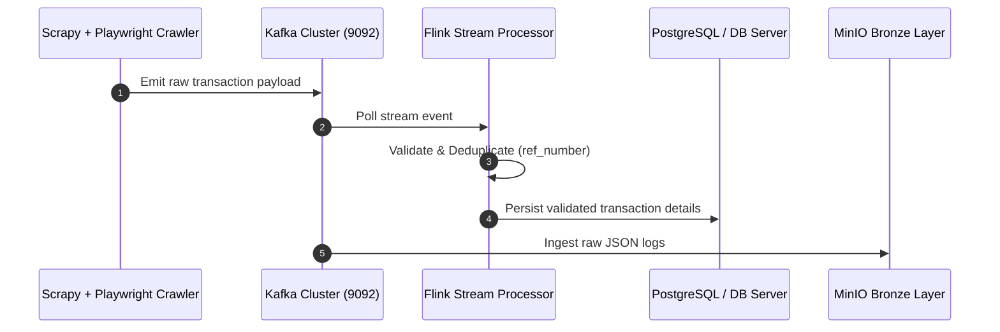
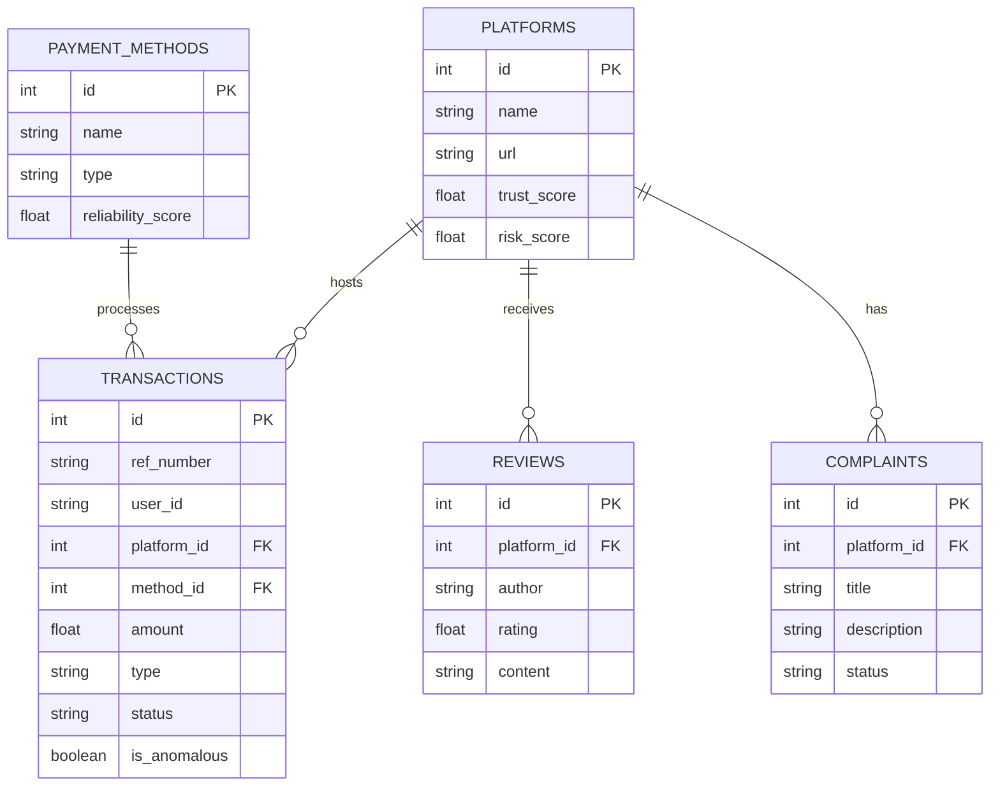

# Multi-Agent AI Data Lakehouse Platform
## Betting Site Data Intelligence & Analytics Console

> [!IMPORTANT]
> **CDAC Final Capstone Project - Clean Architecture Refactoring**  
> Reorganized the platform into Clean Architecture separation of concerns: Frontend, Backend API, Data Collection (Scrapy + Playwright), Streaming (Kafka), Storage (Iceberg + Nessie + PySpark), ML Models, RAG Search, and AI Agents.

---

## ⚡ Live Console Registry

Access the running modules on your web environment or spin them up locally:

| Component / Service | Environment | Access Link | Status Badge |
| :--- | :---: | :--- | :--- |
| **GitHub Pages Web Console** | **Live Web** | [https://957908.github.io/Multi-Agent-AI-Data-Lakehouse-Platform-Betting-Site-Data-Intelligence/](https://957908.github.io/Multi-Agent-AI-Data-Lakehouse-Platform-Betting-Site-Data-Intelligence/) |  |
| **Vite React UI Dashboard** | **Local Dev** | [http://localhost:3000](http://localhost:3000) |  |
| **FastAPI REST Backend** | **Local API** | [http://localhost:8085/docs](http://localhost:8085/docs) |  |
| **Grafana Metrics Analytics** | **Local Dev** | [http://localhost:3001](http://localhost:3001) |  |
| **MinIO Storage Dashboard** | **Local Dev** | [http://localhost:9001](http://localhost:9001) |  |

---

## 1. System Folder Reorganization

The repository has been refactored into modular cleanliness:

* **`frontend/`**: React + TypeScript + Vite dashboard using Tailwind CSS and Recharts. Runs on port `3000`.
* **`backend/`**: FastAPI REST API following Repository Pattern, mapping models/schemas and supporting JWT session authentication. Runs on port `8085`.
* **`data_collection/`**: Centralized **Scrapy** project integrating **Playwright** browser middleware for SPA rendering, proxy rotation, and user-agent spoofing.
* **`streaming/`**: Kafka producer and consumer scripts handling raw payloads with DLQ routing.
* **`stream_processing/`**: Apache Flink consumer simulation performing cleaning and tumbling window metrics.
* **`storage/`**: PySpark batch ETL job configuring Nessie catalog and saving Iceberg tables on MinIO S3 bucket replica.
* **`ml_models/`**: scikit-learn pipeline scripts training Random Forest, Isolation Forest, K-Means models and registering them to mock MLflow tracking.
* **`rag_service/`**: FAISS index builder utilizing `sentence-transformers` and LangChain query routers.
* **`agents/`**: Cooperative crew simulation mapping worker actings (Scraper, Validator, Anomaly, Reporter).
* **`monitoring/`**: Prometheus config scraping backend diagnostic metrics and routing to Grafana (port `3001`).

---

## 2. Platform Architecture Diagrams

### Ingestion & Stream Processing Sequence


### Relational Entity Relationship Diagram (ERD)


---

## 3. Installation & Getting Started

### Step 1: Install Python and Node Libraries
1. Install Python packages:
   ```powershell
   pip install pandas numpy scikit-learn joblib sentence-transformers faiss-cpu fastapi uvicorn playwright sqlalchemy passlib python-jose email-validator kafka-python
   playwright install
   ```
2. Install Frontend Node modules:
   ```powershell
   cd D:\kadam\project\frontend\
   npm install
   ```

### Step 2: Spin Up Infrastructure Containers
Use Docker Compose from the root directory to launch databases, event brokers, and dashboards:
```powershell
cd D:\kadam\project\
docker-compose up -d
```
*Verify containers running inside your Docker client console.*

### Step 3: Run Setup & Startup Pipeline
We created a **Unified Setup and Startup Runner script** to make it extremely easy to run and test the entire Data Lakehouse platform. 
Run:
```powershell
python D:\kadam\project\run_project_pipeline.py
```
This script will verify your dependencies, initialize the database schema, simulate ingestion data, run the ETL job, train machine learning classifiers, and help you launch FastAPI, Grafana, and the dashboard with ease.

---

## 4. Platform Endpoints Summary

| Endpoint | Method | Role | Access |
| :--- | :--- | :--- | :--- |
| `/api/auth/register` | `POST` | Register User accounts | Public |
| `/api/auth/login` | `POST` | Authenticate & retrieve JWT session | Public |
| `/api/platforms` | `GET` | Get betting site ratings and metrics | Public |
| `/api/transactions` | `GET` | Get deduplicated data streams | User |
| `/api/transactions/anomalies` | `GET` | Get flagged ML anomaly records | User |
| `/api/query` | `POST` | Query vector database (RAG chat) | Public |
| `/api/predict-anomaly` | `POST` | Sandbox Isolation Forest boundary test | Public |
| `/api/agents/run` | `POST` | Start background CrewAI simulation task | User |
| `/api/model-diagnostics` | `GET` | Get loaded scikit-learn models info | Public |
